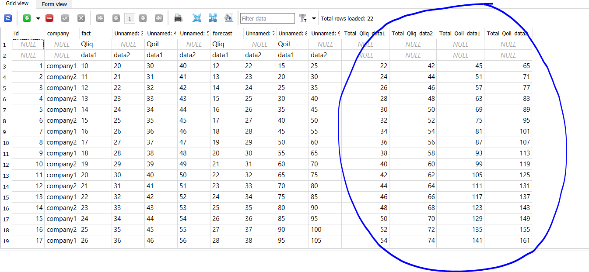

# Парсер exel файла


Данный код предназначен для парсинга вложенного exel(example.xlsx) файла, записи его в бд SQLite и расчёта татала по Qoil, Qliq



##### Для запуска программы из IDE для начала нужно создать виртуальное окружение:
####
```sh
python -m venv venv
```
##### Далее установим все зависимости:

```sh
pip install -r -requirements.txt
```

##### Запуск программы осуществляется командой:

```sh
python parser.py
```

#
### Автор:
**uHDezuT**